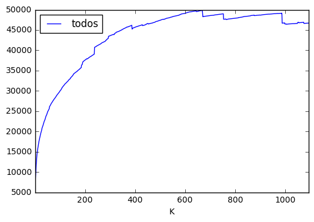

# Histories of unstructured tasks and discussions across repositories

## Set-up

Situated in the directory with all the data files, create a new RepoDataSample object, which indexes all the files based on the provided list of samples


```python
from rds import RepoDataSample, RepoDataHeader
from stopwatch import Stopwatch
import numpy as np
import pandas as pd
from ipywidgets import interact, interactive, fixed
import matplotlib.pyplot as plt
%matplotlib inline
```


```python
cd "C:/Users/<redacted>/Documents/RR7 01.12.2016"
```

    C:\Users\<redacted>\Documents\RR7 01.12.2016
    


```python
rds = RepoDataSample("140repos.csv")
```


```python
print(rds.combined_data.columns)
print(rds.combined_data.shape)
```

    Index(['Added', 'Age', 'Author Intersect', 'Author Union', 'Contexts',
           'Deleted', 'Filetouches', 'filepaths', 'repo', 'safe body',
           'safe contexts', 'todo ID', 'Code', 'Sample', 'minepoch', 'maxepoch',
           'Days of Data'],
          dtype='object')
    (87940, 17)
    

## Sample Validation

The constructor of the RepoDataSample does a lot of file reading and interpreting, and during this emits non-lethal violations.

```python
rds.print_violations() # Prints violations within particular repo handles
```

Violations at the level of datafiles include:

* Failed validate_and_read: missing datafile
* Failed validate_and_read: bad read

Violations at the level of datapoints include:

* Added can be NULL (X time(s))
* Age can be 0 or less
* Authorship commit contribution sum does not equal total commits

Basically all these violations suggest something amiss in data write or read, as so far investigating other failures lead to finding overlong lines and other IO challenges.

```python
print(" ".join(rds.missing_samples())) # Smart enough to exclude samples for which there are datafiles, but no data
print(" ".join(rds.violating_samples())) # Samples where some non-lethal violation in data has been observed
```

These missing or violating sample names can be used in subsequent runs:

```
nohup python3 clean_todo_tab_wrapper_p3force.py --baseDir /home/katja/RUN7 --runHandle stragglers pysb/pysb  biocaml/biocaml  facebook/hhvm torvalds/linux facebook/react-native > /home/katja/RUN7/stragglers.log 2> /home/katja/RUN7/stragglers.err &

nohup python3 clean_todo_tab_wrapper_p3force.py --baseDir /home/katja/RUN7 --runHandle violators ipython/ipython FluidityProject/fluidity dotnet/corefx opencv/opencv git/git bcit-ci/CodeIgniter dotnet/roslyn ShareX/ShareX simbody/simbody cms-sw/cmssw google/protobuf dotnet/coreclr ElmerCSC/elmerfem bitcoin/bitcoin php/php-src sympy/sympy PowerShell/PowerShell elastic/elasticsearch 2> /home/katja/RUN7/violators.err &
```

The violating samples can even be cleaned up from the local directory:

```python
rds = RepoDataSample.refresh(rds, rds.violating_samples()) # This removes files!
```

Another problem was with time:

```python
import time
am = rds.agg_meta()
now = time.time()
print(now)
# Nothing should be older than about 20 years.
# php/php-src for example is 19 years, reported correctly.
print(am[am[RepoDataHeader.DAYS_OF_DATA] > 3650*2])
print(am[am["Earliest Commit Epoch"] == 1])
print(am[am["Latest Commit Epoch"] > now])
```

In this case, the violators were `torvalds/linux` and `angular/angular.js`. So instead of using the summary data, we calculate based on the combined todo information, to see if we do any better.

First, convert the inconveniently human-readable times (sorry!) back into epoch, except indiscriminately: since we know that some added are null, and some deleted are null, in those events we just use either, and the goal is to get the min and max across each column

```python
q = rds.combined_data
q["minepoch"] = q.apply(lambda x: min(to_epoch(x[RepoDataHeader.ADDED], x[RepoDataHeader.DELETED]),
                                      to_epoch(x[RepoDataHeader.DELETED], x[RepoDataHeader.ADDED])), axis = 1)
q["maxepoch"] = q.apply(lambda x: max(to_epoch(x[RepoDataHeader.ADDED], x[RepoDataHeader.DELETED]),
                                      to_epoch(x[RepoDataHeader.DELETED], x[RepoDataHeader.ADDED])), axis = 1)
```

## Filtering Sample

### Data Abundance


```python
# Filter out todos with null deleted values
filtered = rds.filter_todos()
print("Filtered out " + str(filtered) + " data points")
print(rds.combined_data.shape)
```

    Filtered out 46 data points
    (87894, 17)
    


```python
from scipy.stats import mannwhitneyu


def t_test(df, measure, grouping, value1, value2, quietish = False):
    print("---------------")
    print("Grouping by " + grouping + ", comparing " + measure + " between " + value1 + " and " + value2)
    cat1 = df[df[grouping] == value1]
    cat2 = df[df[grouping] == value2]
    if not quietish:
        print(df.groupby(grouping).mean()[measure])
        print(df.groupby(grouping).median()[measure])
        print(df.groupby(grouping).count()[measure])
    print(mannwhitneyu(cat1[measure], cat2[measure])) # Mann Whitney U
    
def get_scatter(sub, c, x, y):
    return plt.scatter(x=sub[x], y=sub[y], s=sub['size'], c=c, alpha = 0.5)

def make_summary_chart(s, x_header, y_header, size_header):
    
    small = 20
    medium = 70
    large = 200
    xlarge = 400
    labels = ['Small', 'Medium', 'Large', 'XLarge']

    size_map = {}

    q1 = s[size_header].quantile(0.25)
    q2 = s[size_header].quantile(0.50)
    q3 = s[size_header].quantile(0.75)

    for index, value in s[size_header].iteritems():
        size_map[index] = (small if value < q1 else
                          (medium if value < q2 else
                          (large if value < q3 else xlarge)))

    s['size'] = pd.Series(size_map)
    
    top10 = get_scatter(s[s[RepoDataHeader.SAMPLE] == "Top10"], 'y', x_header, y_header)
    science = get_scatter(s[s[RepoDataHeader.SAMPLE] == "Science"], 'm', x_header, y_header)
    
    plt.ylabel(y_header)
    plt.xlabel(x_header)

    plt.legend((top10, science),
               ("Top 10", "Science"),
               scatterpoints=1,
               loc='lower left',
               ncol=3,
               fontsize=8)

    plt.show()
```


```python
s = rds.data_by_repo()
make_summary_chart(s, RepoDataHeader.LOG + RepoDataHeader.DAYS_OF_DATA, RepoDataHeader.AGE, RepoDataHeader.LOC)

s = s[s[RepoDataHeader.AGE] < 1500]
make_summary_chart(s, RepoDataHeader.LOG + RepoDataHeader.DAYS_OF_DATA, RepoDataHeader.AGE, RepoDataHeader.LOC)
```


### Q: What size should the timing threshhold be?


```python
def k_cutoff_repos(repo_df, K = None):
    if (K == None):
        return repo_df
    return repo_df[repo_df[RepoDataHeader.DAYS_OF_DATA] >= K]

def k_cutoff_todos(todo_df, K = None):
    if (K == None):
        return todo_df
    temp = todo_df[todo_df[RepoDataHeader.DAYS_OF_DATA] >= K]
    temp = temp[temp[RepoDataHeader.ADDED].notnull()]
    temp = temp[temp[RepoDataHeader.DELETED].notnull()]
    return temp[temp[RepoDataHeader.AGE] <= K]

def sci_only(df):
    return df[df[RepoDataHeader.SAMPLE] == "Science"]
```


```python
from __future__ import print_function
from ipywidgets import interact, interactive, fixed
import ipywidgets as widgets

data = {"K": [], "repos": [], "todos": [], "sci repos": [], "sci todos": []}

s = rds.data_by_repo()

for K in range(1, 365*3):
    data["K"].append(K)
    sub = k_cutoff_repos(s, K)
    sl = len(sub)
    data["repos"].append(sl)
    sub = sci_only(sub)
    data["sci repos"].append((len(sub)/sl))
    
    sub = k_cutoff_todos(rds.combined_data, K)
    sl = len(sub)
    data["todos"].append(sl)
    
    sub = sci_only(sub)
    data["sci todos"].append((len(sub)/sl))
    

df = pd.DataFrame(data)
```


```python
from matplotlib.font_manager import FontProperties

df["repos normalized"] = df["repos"] / len(s)
df["todos normalized"] = df["todos"] / len(rds.combined_data[rds.combined_data[RepoDataHeader.DELETED].notnull()])

y = ['todos normalized', "repos normalized", "sci repos", "sci todos"]
df.plot(x='K', y=y)

fontP = FontProperties()
fontP.set_size(5)
plt.ylabel("normalized against unfiltered total")
plt.xlabel("K, time-based filtering threshhold")
plt.legend(y, prop = fontP)

```


    <matplotlib.legend.Legend at 0xd7237baf60>


```python
df.plot(x='K', y='todos')
```


    <matplotlib.axes._subplots.AxesSubplot at 0xd7238e8240>





```python
df.plot(x='K', y='repos')
```


    <matplotlib.axes._subplots.AxesSubplot at 0xd723940780>


From the above plot, we see that in fact the correlation between Age and Days of Data does not vary that much between runs. the quesiton remains, however, if there is a **difference in days of data or age between the samples**. The below tests suggest that the science repositories are bot older and have older todos, but based on the above correlation plot, can we be reasonably convinced that these measures are sufficiently independent?


```python
todo_df = rds.combined_data
repo_df = rds.data_by_repo()

t_test(k_cutoff_repos(repo_df, 650), RepoDataHeader.DAYS_OF_DATA, RepoDataHeader.SAMPLE, "Science", "Top10")
t_test(k_cutoff_todos(todo_df, 650), RepoDataHeader.AGE, RepoDataHeader.SAMPLE, "Science", "Top10")
```

    ---------------
    Grouping by Sample, comparing Days of Data between Science and Top10
    Sample
    Science    2314.011744
    Top10      2012.596630
    Name: Days of Data, dtype: float64
    Sample
    Science    1955.100347
    Top10      1792.942708
    Name: Days of Data, dtype: float64
    Sample
    Science    34
    Top10      88
    Name: Days of Data, dtype: int64
    MannwhitneyuResult(statistic=1352.0, pvalue=0.2062716214195261)
    ---------------
    Grouping by Sample, comparing Age between Science and Top10
    Sample
    Science    124.045616
    Top10      135.358764
    Name: Age, dtype: float64
    Sample
    Science    49.968310
    Top10      61.725521
    Name: Age, dtype: float64
    Sample
    Science    11099
    Top10      38477
    Name: Age, dtype: int64
    MannwhitneyuResult(statistic=209319506.0, pvalue=0.0007661341453919523)
    


```python
## Normalization

print(len(rds.combined_data))
df = rds.combined_data[rds.combined_data[RepoDataHeader.DELETED].notnull()]
print("Remove not opened: " + str(len(df)))
df = df[df[RepoDataHeader.ADDED].notnull()]
print("Remove truncated histories: " + str(len(df)))
df = df[df[RepoDataHeader.AGE] > 0]
print("Remove error histories: " + str(len(df)))
df = df[df[RepoDataHeader.AGE] < df[RepoDataHeader.DAYS_OF_DATA]]
print("Remove range errors: " + str(len(df)))
df = df[df[RepoDataHeader.DAYS_OF_DATA] > 0]
df["norm" + RepoDataHeader.AGE]  = df[RepoDataHeader.AGE] / df[RepoDataHeader.DAYS_OF_DATA]
print(df["norm" + RepoDataHeader.AGE].max())
print(df["norm" + RepoDataHeader.AGE].mean())
print(df["norm" + RepoDataHeader.AGE].median())
print(df["norm" + RepoDataHeader.AGE].min())


t_test(df, "norm" + RepoDataHeader.AGE, RepoDataHeader.SAMPLE, "Science", "Top10")
```

    87894
    Remove not opened: 61226
    Remove truncated histories: 61226
    Remove error histories: 61089
    Remove range errors: 61066
    0.999997118986
    0.13363754657228688
    0.04457460672928337
    2.696191037e-09
    ---------------
    Grouping by Sample, comparing normAge between Science and Top10
    Sample
    Science    0.158263
    Top10      0.124561
    Name: normAge, dtype: float64
    Sample
    Science    0.045271
    Top10      0.043313
    Name: normAge, dtype: float64
    Sample
    Science    16446
    Top10      44620
    Name: normAge, dtype: int64
    MannwhitneyuResult(statistic=343226687.0, pvalue=7.8140257553073116e-35)
    

## Next up: Generating training and testing sets

Don't forget to update the time-adjust threshhold!


```python
from sklearn.cross_validation import train_test_split
from ipywidgets import interact, interactive, fixed
import ipywidgets as widgets

def train_set_gen(k, train):
    print("K: "+ str(k))
    filtered_by_k = k_cutoff_todos(rds.combined_data, k)

    total = len(filtered_by_k)
    desired = train
    stratfraction = (desired/total if desired < total else 1)

    print("Total: " + str(len(rds.combined_data)))
    print("Filtered by K: " + str(total))

    filtered_by_k[RepoDataHeader.REPO] = filtered_by_k.index
    y = filtered_by_k.pop(RepoDataHeader.REPO)
    X = filtered_by_k
    X_train, X_test, y_train, y_test = train_test_split( X, y, test_size = (1-stratfraction), random_state=42)

    print("In training set: " + str(len(X_train)))

interact(train_set_gen, k=widgets.IntSlider(min=600,max=700,step=10,value=650),
        train=widgets.IntSlider(min=10,max=500,step=10,value=10), __manual=True)
```

    K: 650
    Total: 87894
    Filtered by K: 62262
    In training set: 500
    
